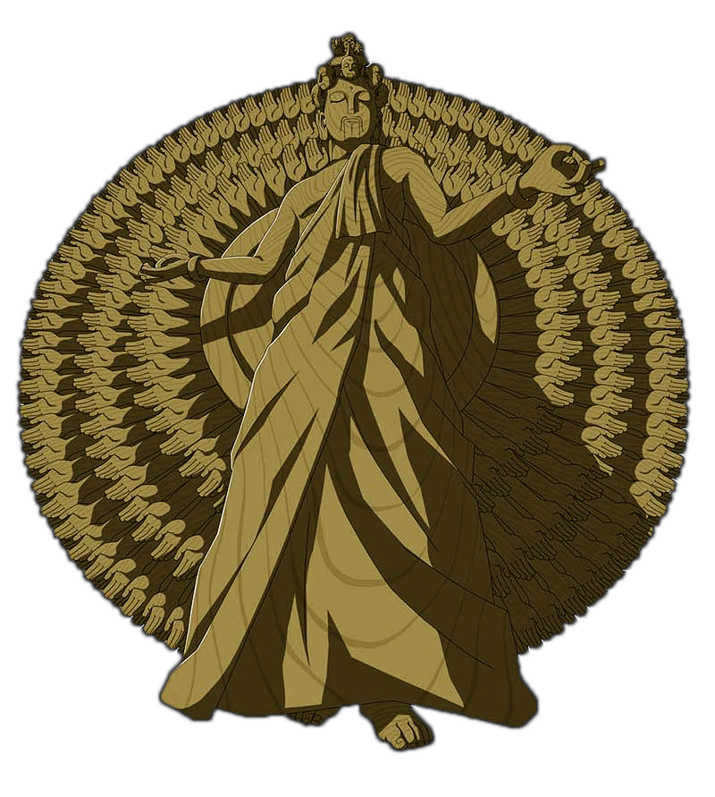

# Senju
Resource loader requirejs plugin.


## Usage
``` javascript
// Config 
requirejs.config({
	baseUrl: 'js',
	waitSeconds:200,
	urlArgs: '_='+(new Date()).getTime(),
	paths: {
		'senju': 'util/senju' // Set an alias for senju
	}
});
// Creating a module component
define(function (require) {
    "use strict";
    require('util/domReady!');
    var mod1 = require('mod1');
    var mod2 = require('mod2');
    // Senju loads a resource file ang parses its contents for this component.
    var resource = require('senju!resources/r1.html');
    // View contents from resource(usually html templates)
    console.dir(resource);
    
    mod1.init();
    mod2.init();
});                       
```

## Sample resource file contents
Resource files are normal html files with a twist.
``` html 
<resource>
	<!-- These are external css. Usually for third party plugins -->
	<csslink src="css/normalize.css" wait="true"/>
	<csslink src="css/all.css" wait="true"/>
	<csslink src="css/asciidoctor.css" />
	<csslink src="css/all-rtl.css" wait="true" />	
	
	<!-- These are inline styles -->
	<style type="css-resource" variables="green:#b4d455,grey:#ccc,angry:1px solid #FF5555,center:0 auto">
		body {
			background-color: $grey;
			padding-top: 10px;
		}
		#foo {
			color: $green;
			width: 300px;
			display: block;
			border: $angry;
			margin: $center;
			background-color: #363636;
		}
		ul {
			margin-right: 0;
		}
		li {
			background-color: #F8ECB4;
			margin: 3px;
			list-style: none;
			padding: 3px;
		}
		h1 {
			color: #fff;
			text-align: center;
		}
	</style>
	
	<!-- These are templates -->
	<template id="foo">
		<section>{test}</section>
	</template>
	<template id="bar">
		<h1>Resource Test</h1>
		<!-- test comment -->
		<ul>
			<li>aaaaaa</li>
			<li>bbbbbb</li>
			<!-- test comment 2 -->
			<li>cccccc</li>
			<li>dddddd</li>
		</ul>
	</template>
</resource>
```

## License 
MIT

## Senju of the Thousand Hands
<a href=""https://www.google.com.ph/search?q=senju+naruto&source=lnms&tbm=isch&sa=X&ved=0ahUKEwiSis_V7bvTAhVHWrwKHT3wAX8Q_AUICCgB&biw=1438&bih=725#tbm=isch&q=senju+of+the+thousand+hands&imgdii=M_F_Bp-uaQO7WM:&imgrc=6pO2R8n5_SZpCM:></a>